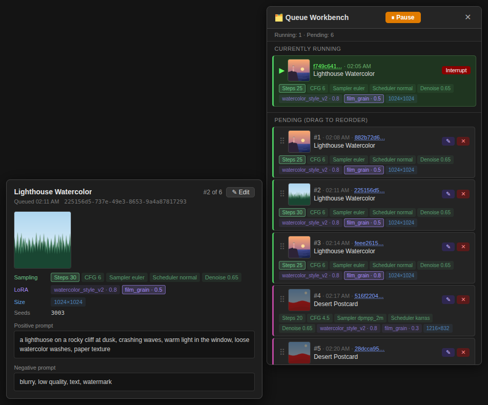
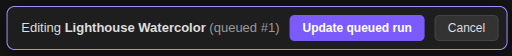
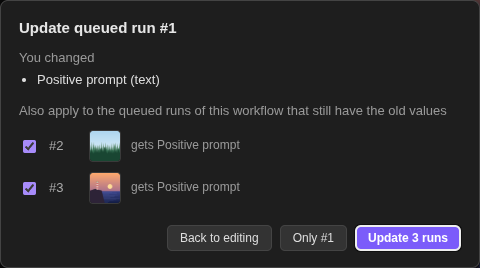
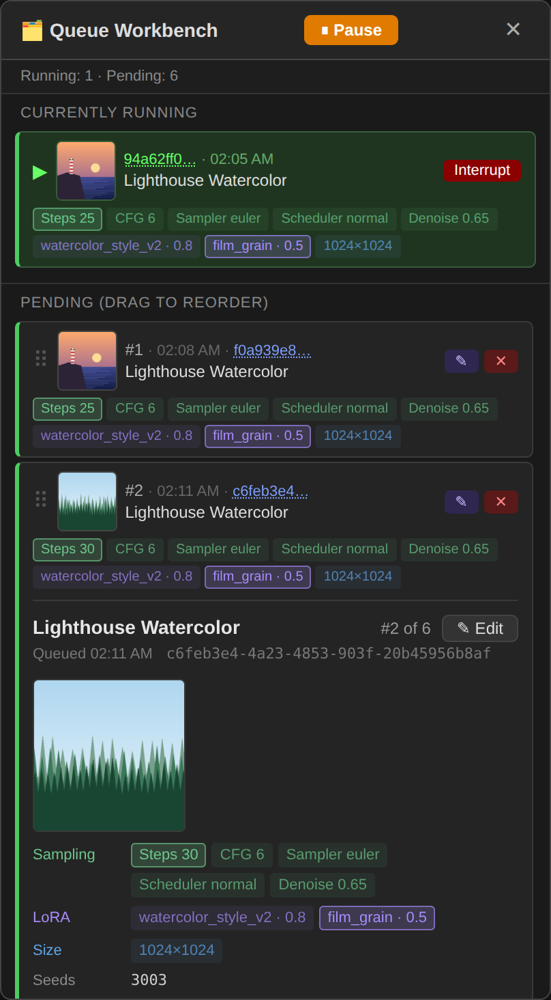

# ComfyUI Queue Workbench

A queue panel for ComfyUI that lets you see what's actually in your queue, tell
runs of the same workflow apart, and fix a queued run without re-queueing it.



## Features

- **Tell queued runs apart.** Each row shows the workflow name, when it was
  queued, a colour stripe per workflow, the input images, and colour-coded chips
  for the key settings: sampling (steps, CFG, sampler, …), time (duration,
  frames, FPS), active LoRAs with their strength, and size (aspect ratio,
  megapixels, width×height). **Bright chips differ from the workflow's other
  queued runs; dimmed ones are the same for all of them.** Images follow the
  same rule.
- **Detail card.** Hover a row (desktop) or tap it (touch) to see every input
  image, all settings, the seeds and the full prompt. When runs of a workflow
  have different prompts, the shared part is greyed out and the box scrolls to
  where they start to differ.
- **Edit queued runs in place.** Click ✎ to open a queued run in its own tab,
  change anything, and press **Update queued run**. The run keeps its place in
  the queue. If other queued runs of the same workflow still have the old values,
  you can copy the change into them in one go. Each keeps its own seed, image
  and other values.
- **Reorder, pause, delete.** Drag rows to reorder (runs keep their IDs), pause
  the queue while the current run finishes, delete single runs.
- **History.** The *History* tab lists the last 200 finished runs, newest first,
  with the same rows as the queue plus the first output, a ✓ / ✕ / ⏹ status mark,
  finish time and duration. The detail card shows every output and, for a failed
  run, the error. Queue a run again with ⤴ (same settings, same seed) or remove it
  with ✕. The history survives restarts.
- **Survives restarts.** Pending and paused runs are mirrored to a local SQLite
  file. After a restart or crash they show up as *Saved from previous session*,
  where you can restore or discard them. Nothing re-runs on its own.
- **Live preview everywhere.** The running row shows the sampler preview, also
  on devices that didn't queue the run (e.g. your phone on the same server).
- **Optional push notification** via [ntfy](https://ntfy.sh) when a generation
  finishes, with the result attached.

| Edit a queued run | Copy the change to the workflow's other runs | On a phone |
|---|---|---|
|  |  |  |

## Installation

```bash
cd ComfyUI/custom_nodes
git clone https://github.com/SmeggyBoi/ComfyUI-QueueWorkbench
```

Restart ComfyUI, then reload the browser tab. Open the panel with the 🗂️ button
next to *Run*.

There are no Python dependencies to install.

To update, run `git pull` in the folder, restart ComfyUI and hard-reload the
browser (Ctrl+Shift+R). If the browser still runs an old copy of the script, a
red banner at the top tells you so.

## Usage

| What | How |
|---|---|
| Open the panel | 🗂️ button next to *Run* |
| See everything about a run | Hover a row (desktop) or tap it (touch) |
| Open a run as a normal copy | Click its short ID |
| Edit a run in place | ✎ on the row or *✎ Edit* in the detail card, change the graph, then **Update queued run** (or **Cancel**) |
| Reorder | Drag a row onto another |
| Pause / resume | *Pause* in the panel header. The running job finishes; nothing else starts until you resume. |
| Restore after a restart | *Saved from previous session* section: restore one or all, or discard |
| See finished runs | *History* tab; *Show more* loads older ones |
| Run a finished run again | ⤴ on its history row (same seed) |
| Remove a run from the history | ✕ on its history row (output files stay) |

### How editing works

- Your edit is compared with the run as it was loaded into the tab. Only the
  values you changed count, so anything you didn't touch stays exactly as it was
  queued.
- **Update** applies the edit only if the server accepts the whole graph, with
  every output valid. Otherwise you get an error naming the node, and the tab
  stays open.
- Other queued runs of the same workflow are offered only where they still have
  the *old* value. Changing a seed never spreads, while fixing a typo in a shared
  prompt reaches every run that has it.
- Adding or removing nodes or links applies to the edited run only.
- If the run starts while you're editing, you can queue your edit as a new run
  or keep the tab as a copy.

## Configuration (optional)

Push notifications are off unless you configure an ntfy topic. Copy
`config.example.json` to `config.json` in this folder and fill in:

| Key | Meaning |
|---|---|
| `ntfy_url` | Full topic URL, e.g. `https://ntfy.sh/my-secret-topic` or your own server |
| `public_url` | The address your phone uses to reach ComfyUI. If set, the notification attaches the finished file and gets an *Open in browser* button. |
| `ntfy_quiet_seconds` | Waits this long after the last finished run before notifying. Workflows that finish in several passes then send one notification for the final file. Default 90. |

Environment variables `QUEUE_WORKBENCH_NTFY_URL` and
`QUEUE_WORKBENCH_PUBLIC_URL` override the file. Restart ComfyUI after changes.

### Notifications and downloads on your phone with Tailscale

The attachment in a notification is a link to your ComfyUI, so your phone has
to be able to reach it, including when you're away from home.
[Tailscale](https://tailscale.com) puts your PC and your phone in a private
network (a *tailnet*) without opening any ports to the internet.

1. Install Tailscale on the ComfyUI machine and on your phone, and sign in to
   both with the same account.
2. Make ComfyUI reachable in the tailnet. The simplest way keeps ComfyUI on its
   default `127.0.0.1:8188`, and Tailscale serves it over HTTPS:

   ```bash
   tailscale serve --bg 8188
   ```

   The first time, Tailscale asks you to enable HTTPS certificates for your
   tailnet. It then prints the address, e.g. `https://my-pc.tail1234.ts.net`.
   `tailscale serve off` stops it.

   Alternatively, start ComfyUI with `--listen 100.x.y.z` (the machine's
   Tailscale IP) and use `http://100.x.y.z:8188`, or the MagicDNS name
   `http://my-pc:8188`.
3. Put that address in `config.json`:

   ```json
   {
     "ntfy_url": "https://ntfy.sh/a-long-random-topic-name",
     "public_url": "https://my-pc.tail1234.ts.net"
   }
   ```

4. Install the ntfy app on your phone and subscribe to the same topic.

The download link only works on devices in your tailnet, so it's useless to
anyone else even when the notification goes through the public ntfy.sh server.
Still pick a long, random topic name: anyone who knows it can read your
notifications. You can also self-host ntfy on the same machine and reach it
through the tailnet. The same address also opens ComfyUI itself on your phone,
including this panel and its live preview.

## Compatibility

- Tested with ComfyUI 0.37.4 and frontend 1.52.7.
- Needs the current (Vue-based) ComfyUI frontend.
- Editing in place uses parts of the frontend's workflow-tab handling that
  aren't a public API, so a future frontend update could break it. The rest of
  the panel works independently.
- If ComfyUI wasn't restarted after installing or updating, ✎ stays hidden,
  reordering falls back to deleting and re-queueing, and the History tab can't
  load.

## Known limitations

- Runs held by *Pause* aren't listed (or editable) until you resume.
- Updating a run re-reads the graph, so `{a|b}` random prompt syntax is rolled
  again, as it would be on a normal re-queue. Wildcard nodes in "populate" mode
  don't re-run on update.
- A run queued with "queue selected output nodes" runs all outputs after it has
  been edited.
- Queueing a finished run again doesn't carry your Comfy.org login, so runs with
  paid API nodes fail when queued again from the history.

## Privacy

Everything stays on your machine. The only network request this extension makes
is the ntfy notification, and only if you configure it. The persistence file
`queue_persist.db` (in this folder) contains your queued prompts and workflows, and those of your last 200 finished runs. Since it keeps the full workflow of each of those 200 runs, it can grow to tens of MB with large workflows.

## Development

```bash
node tests/test_edit_diff.mjs                 # frontend logic (Node 18+)
node tests/test_history.mjs                   # history tab logic
python -m unittest discover -s tests -v       # backend logic (needs aiohttp)
```

The tests stub ComfyUI, so they run without a GPU or a ComfyUI install.

## License

MIT, see [LICENSE](LICENSE).
